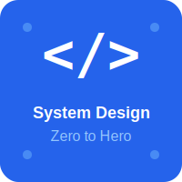

<div align="center">
  
  
  # System Design Zero to Hero
  
  [](https://opensource.org/licenses/MIT)
  [](https://youtube.com)
  
  **A complete beginner-to-advanced learning series with simple explanations + YouTube Shorts**
  
  *Master system design concepts from zero to hero with practical examples, diagrams, and video tutorials*
  
  [📺 YouTube Channel](#) | [📚 Documentation](#phases) | [💬 Discussions](#)
</div>

---

## 📋 Table of Contents

- [About](#about)
- [Learning Path](#learning-path)
- [Phases](#phases)
  - [Phase 1: Fundamentals](#phase-1-fundamentals)
  - [Phase 2: Core Concepts](#phase-2-core-concepts)
  - [Phase 3: Advanced Topics](#phase-3-advanced-topics)
  - [Phase 4: Real-World Systems](#phase-4-real-world-systems)
- [Resources](#resources)
- [Contributing](#contributing)
- [License](#license)

---

## 🎯 About

This repository is your comprehensive guide to mastering **System Design** from the ground up. Whether you're preparing for technical interviews, building scalable applications, or simply expanding your knowledge, this structured learning path will take you from zero to hero.

### What You'll Learn

- ✅ Fundamental concepts of distributed systems
- ✅ Scalability, reliability, and availability patterns
- ✅ Database design and data modeling
- ✅ Caching strategies and CDN usage
- ✅ Load balancing and API design
- ✅ Real-world system architecture examples
- ✅ Best practices and trade-offs

### How to Use This Repository

1. **Follow the phases sequentially** - Each phase builds upon the previous one
2. **Watch the YouTube videos** - Visual explanations complement the written content
3. **Study the diagrams** - Available in the `/diagrams` folder
4. **Practice** - Try to design systems on your own after each phase
5. **Engage** - Ask questions and share your learnings

---

## 🛤️ Learning Path

```
📍 Start Here → Phase 1 (Fundamentals) → Phase 2 (Core Concepts) → 
Phase 3 (Advanced) → Phase 4 (Real-World) → 🎓 System Design Expert
```

**Estimated Time:** 8-12 weeks (at your own pace)

---

## 📚 Phases

### Phase 1: Fundamentals

> **Goal:** Build a strong foundation in basic concepts and terminology
> 
> **Duration:** 2-3 weeks | **Videos:** Coming Soon

<details>
<summary><b>📘 1.1 Introduction to System Design</b></summary>

### What is System Design?

Learn the basics of what system design is and why it matters in modern software development.

**Topics Covered:**
- What is system design?
- Why is it important?
- Common interview questions
- Real-world applications

**Resources:**
- 📺 YouTube Video: [Coming Soon](#)
- 📄 Diagram: `/diagrams/phase1/introduction.png`
- 📝 Notes: Key takeaways and definitions

**Key Takeaways:**
- System design is about building scalable, reliable systems
- It involves making trade-offs between different approaches
- Understanding requirements is the first step

</details>

<details>
<summary><b>📘 1.2 Client-Server Architecture</b></summary>

### Understanding Client-Server Model

Deep dive into how clients and servers communicate.

**Topics Covered:**
- Request-response cycle
- HTTP/HTTPS protocols
- REST APIs basics
- Client types (web, mobile, desktop)

**Resources:**
- 📺 YouTube Video: [Coming Soon](#)
- 📄 Diagram: `/diagrams/phase1/client-server.png`

**Key Takeaways:**
- Clients initiate requests, servers respond
- Protocols define communication rules
- Stateless vs stateful communication

</details>

<details>
<summary><b>📘 1.3 Network Basics</b></summary>

### Networking Fundamentals

Understanding how data moves across networks.

**Topics Covered:**
- TCP/IP basics
- DNS (Domain Name System)
- Latency and bandwidth
- Network protocols

**Resources:**
- 📺 YouTube Video: [Coming Soon](#)
- 📄 Diagram: `/diagrams/phase1/network-basics.png`

**Practice Exercise:**
- Trace a request from browser to server and back

</details>

<details>
<summary><b>📘 1.4 Storage Basics</b></summary>

### Data Storage Fundamentals

Introduction to how systems store and retrieve data.

**Topics Covered:**
- File systems
- Databases (relational vs non-relational)
- Memory vs disk storage
- Persistence concepts

**Resources:**
- 📺 YouTube Video: [Coming Soon](#)
- 📄 Diagram: `/diagrams/phase1/storage-basics.png`

</details>

---

### Phase 2: Core Concepts

> **Goal:** Master essential system design building blocks
> 
> **Duration:** 3-4 weeks | **Videos:** Coming Soon

<details>
<summary><b>🔧 2.1 Scalability</b></summary>

### Scaling Your System

Learn how to design systems that can handle growth.

**Topics Covered:**
- Vertical vs horizontal scaling
- Stateless architectures
- Scaling databases
- Bottlenecks and solutions

**Resources:**
- 📺 YouTube Video: [Coming Soon](#)
- 📄 Diagram: `/diagrams/phase2/scalability.png`

**Real-World Examples:**
- How Netflix scales to millions of users
- Instagram's scaling journey

</details>

<details>
<summary><b>🔧 2.2 Load Balancing</b></summary>

### Distributing Traffic Effectively

Understanding how to distribute requests across multiple servers.

**Topics Covered:**
- Load balancer types (L4 vs L7)
- Load balancing algorithms (Round Robin, Least Connections, etc.)
- Health checks
- Session persistence

**Resources:**
- 📺 YouTube Video: [Coming Soon](#)
- 📄 Diagram: `/diagrams/phase2/load-balancing.png`

</details>

<details>
<summary><b>🔧 2.3 Caching</b></summary>

### Speed Up Your System

Learn how to use caching to improve performance.

**Topics Covered:**
- Cache hit/miss
- Cache eviction policies (LRU, LFU, FIFO)
- Where to cache (client, CDN, server, database)
- Cache invalidation strategies

**Resources:**
- 📺 YouTube Video: [Coming Soon](#)
- 📄 Diagram: `/diagrams/phase2/caching.png`

**Key Quote:**
> "There are only two hard things in Computer Science: cache invalidation and naming things." - Phil Karlton

</details>

<details>
<summary><b>🔧 2.4 Database Design</b></summary>

### Designing Efficient Data Models

Master the art of database design and selection.

**Topics Covered:**
- SQL vs NoSQL
- Database normalization
- Indexing strategies
- Sharding and partitioning
- Replication

**Resources:**
- 📺 YouTube Video: [Coming Soon](#)
- 📄 Diagram: `/diagrams/phase2/database-design.png`

</details>

<details>
<summary><b>🔧 2.5 Content Delivery Network (CDN)</b></summary>

### Serving Static Content Globally

Learn how CDNs improve content delivery worldwide.

**Topics Covered:**
- How CDNs work
- Edge locations
- Cache control headers
- Popular CDN providers

**Resources:**
- 📺 YouTube Video: [Coming Soon](#)
- 📄 Diagram: `/diagrams/phase2/cdn.png`

</details>

<details>
<summary><b>🔧 2.6 Message Queues</b></summary>

### Asynchronous Communication

Understanding message queues and event-driven architectures.

**Topics Covered:**
- Queue vs topic
- Producer-consumer pattern
- Message brokers (RabbitMQ, Kafka)
- Use cases and benefits

**Resources:**
- 📺 YouTube Video: [Coming Soon](#)
- 📄 Diagram: `/diagrams/phase2/message-queues.png`

</details>

---

### Phase 3: Advanced Topics

> **Goal:** Deep dive into complex system design patterns
> 
> **Duration:** 3-4 weeks | **Videos:** Coming Soon

<details>
<summary><b>🚀 3.1 Microservices Architecture</b></summary>

### Building Distributed Systems

Learn how to design and implement microservices.

**Topics Covered:**
- Monolith vs microservices
- Service discovery
- API Gateway
- Inter-service communication
- Distributed transactions

**Resources:**
- 📺 YouTube Video: [Coming Soon](#)
- 📄 Diagram: `/diagrams/phase3/microservices.png`

**Pros and Cons:**
- ✅ Independent deployment and scaling
- ✅ Technology diversity
- ❌ Increased complexity
- ❌ Network latency

</details>

<details>
<summary><b>🚀 3.2 Consistency and CAP Theorem</b></summary>

### Understanding Distributed System Trade-offs

Master the fundamental theorem of distributed systems.

**Topics Covered:**
- CAP theorem explained
- Consistency models (strong, eventual, causal)
- Consistency vs availability trade-offs
- Practical implications

**Resources:**
- 📺 YouTube Video: [Coming Soon](#)
- 📄 Diagram: `/diagrams/phase3/cap-theorem.png`

</details>

<details>
<summary><b>🚀 3.3 Rate Limiting</b></summary>

### Protecting Your System

Learn how to implement rate limiting and throttling.

**Topics Covered:**
- Rate limiting algorithms (Token bucket, Leaky bucket, Fixed window, Sliding window)
- Where to implement rate limiting
- Distributed rate limiting
- API quotas

**Resources:**
- 📺 YouTube Video: [Coming Soon](#)
- 📄 Diagram: `/diagrams/phase3/rate-limiting.png`

</details>

<details>
<summary><b>🚀 3.4 Security and Authentication</b></summary>

### Building Secure Systems

Understanding security best practices in system design.

**Topics Covered:**
- Authentication vs authorization
- OAuth 2.0 and JWT
- API security
- Encryption (in-transit and at-rest)
- Common vulnerabilities

**Resources:**
- 📺 YouTube Video: [Coming Soon](#)
- 📄 Diagram: `/diagrams/phase3/security.png`

</details>

<details>
<summary><b>🚀 3.5 Monitoring and Observability</b></summary>

### Keeping Systems Healthy

Learn how to monitor and debug distributed systems.

**Topics Covered:**
- Metrics, logs, and traces
- Monitoring tools
- Alerting strategies
- Debugging distributed systems
- SLIs, SLOs, and SLAs

**Resources:**
- 📺 YouTube Video: [Coming Soon](#)
- 📄 Diagram: `/diagrams/phase3/monitoring.png`

</details>

---

### Phase 4: Real-World Systems

> **Goal:** Apply knowledge to design real-world systems
> 
> **Duration:** 2-3 weeks | **Videos:** Coming Soon

<details>
<summary><b>🏗️ 4.1 Design a URL Shortener</b></summary>

### System Design: URL Shortener (like bit.ly)

Complete walkthrough of designing a URL shortening service.

**Requirements:**
- Shorten long URLs to unique short URLs
- Redirect short URLs to original URLs
- Track click analytics
- Handle millions of requests

**Components Covered:**
- API design
- Database schema
- Unique ID generation
- Caching strategy
- Analytics pipeline

**Resources:**
- 📺 YouTube Video: [Coming Soon](#)
- 📄 Diagram: `/diagrams/phase4/url-shortener.png`

**Follow-up Questions:**
- How would you handle custom URLs?
- How would you scale to billions of URLs?
- How would you prevent abuse?

</details>

<details>
<summary><b>🏗️ 4.2 Design a Social Media Feed</b></summary>

### System Design: News Feed (like Twitter/Instagram)

Design a social media feed system.

**Requirements:**
- Post creation and storage
- Timeline generation (home feed)
- Follow/unfollow users
- Like and comment features
- Real-time updates

**Components Covered:**
- Fan-out strategies (push vs pull)
- Timeline generation
- Caching hot posts
- Notification system
- Media storage

**Resources:**
- 📺 YouTube Video: [Coming Soon](#)
- 📄 Diagram: `/diagrams/phase4/social-feed.png`

</details>

<details>
<summary><b>🏗️ 4.3 Design a Chat Application</b></summary>

### System Design: Messaging System (like WhatsApp)

Build a real-time messaging platform.

**Requirements:**
- One-on-one messaging
- Group chats
- Online status
- Message delivery confirmation
- Message history

**Components Covered:**
- WebSocket connections
- Message queue
- Message storage
- Push notifications
- End-to-end encryption basics

**Resources:**
- 📺 YouTube Video: [Coming Soon](#)
- 📄 Diagram: `/diagrams/phase4/chat-app.png`

</details>

<details>
<summary><b>🏗️ 4.4 Design a Video Streaming Platform</b></summary>

### System Design: Video Platform (like YouTube)

Design a video streaming service.

**Requirements:**
- Video upload and processing
- Video streaming
- Recommendations
- Comments and likes
- Search functionality

**Components Covered:**
- Video transcoding
- CDN for video delivery
- Adaptive bitrate streaming
- Storage optimization
- Recommendation engine basics

**Resources:**
- 📺 YouTube Video: [Coming Soon](#)
- 📄 Diagram: `/diagrams/phase4/video-streaming.png`

</details>

<details>
<summary><b>🏗️ 4.5 Design an E-commerce Platform</b></summary>

### System Design: Online Shopping (like Amazon)

Build a scalable e-commerce system.

**Requirements:**
- Product catalog
- Shopping cart
- Order management
- Payment processing
- Inventory management

**Components Covered:**
- Search and filtering
- Transaction management
- Payment gateway integration
- Inventory sync
- Order fulfillment pipeline

**Resources:**
- 📺 YouTube Video: [Coming Soon](#)
- 📄 Diagram: `/diagrams/phase4/ecommerce.png`

</details>

<details>
<summary><b>🏗️ 4.6 Design a Ride-Sharing Service</b></summary>

### System Design: Ride-Hailing (like Uber)

Design a location-based ride-sharing platform.

**Requirements:**
- Driver and rider matching
- Real-time location tracking
- ETA calculation
- Pricing and payments
- Trip history

**Components Covered:**
- Geospatial indexing
- Location services
- Matching algorithms
- Real-time tracking with WebSocket
- Surge pricing

**Resources:**
- 📺 YouTube Video: [Coming Soon](#)
- 📄 Diagram: `/diagrams/phase4/ride-sharing.png`

</details>

---

## 📖 Resources

### Additional Learning Materials

- **Books**
  - "Designing Data-Intensive Applications" by Martin Kleppmann
  - "System Design Interview" by Alex Xu
  - "Building Microservices" by Sam Newman

- **Online Courses**
  - [Coming Soon] Link to full video course
  - [Coming Soon] Interactive exercises

- **Tools for Practice**
  - Draw.io / Excalidraw - For creating diagrams
  - LucidChart - Professional diagramming
  - System Design Primer (GitHub)

### Community

- 💬 [Discussions](#) - Ask questions and share your designs
- 🐛 [Issues](#) - Report errors or suggest improvements
- 📧 Contact: [Your Email]

---

## 🤝 Contributing

We welcome contributions! If you'd like to add:

- New system design examples
- Improved diagrams
- Better explanations
- Corrections

Please:
1. Fork the repository
2. Create a feature branch (`git checkout -b feature/new-topic`)
3. Make your changes
4. Submit a pull request

See [CONTRIBUTING.md](CONTRIBUTING.md) for detailed guidelines.

---

## 📜 License

This project is licensed under the MIT License - see the [LICENSE](LICENSE) file for details.

---

## 🙏 Acknowledgments

Special thanks to:
- The open-source community
- System design experts and educators
- All contributors

---

<div align="center">
  
  **⭐ Star this repository if you find it helpful!**
  
  Made with ❤️ for aspiring system designers
  
  [Back to Top ↑](#system-design-zero-to-hero)
  
</div>
